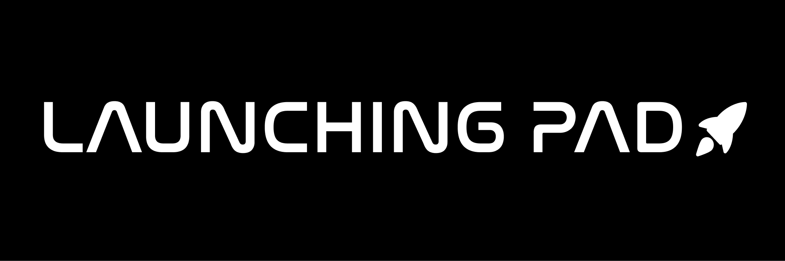

<p align="center">

  <a href="LICENSE" style="text-decoration: none">
    
  </a>

  <a href="https://github.com/wesleyfeitosa/launching-pad/issues" style="text-decoration: none">
    
  </a>

  <a href="#" style="text-decoration: none">
    
  </a>

  <a href="https://github.com/wesleyfeitosa/launching-pad/stargazers" style="text-decoration: none">
    
  </a>

</p>

## :rocket: Technologies

This project was developed with the following technologies:

- [React](https://reactjs.org)
- [Typescript](https://www.typescriptlang.org/)
- [NextJS](https://nextjs.org/)

## 💻 Project

This project was done with the purpose of creating a place where it was easy to find information about the upcoming releases of the company SpaceX. In addition to upcoming releases, this application also brings current information on past launches, rockets used, dates and locations and locations.


## :hammer: Deploy

- Frontend/Web: https://launching-pad.vercel.app/

## 🤔 How to contribute

- Fork this repository;
- Create a branch with your feature: `git checkout -b my-feature`;
- Commit your changes: `git commit -m 'feat: My new feature'`;
- Push to your branch: `git push origin my-feature`.

After the merge of your pull request is done, you can delete your branch.

## 🔖 How to run

#### Cloning the project
```sh
git clone https://github.com/wesleyfeitosa/launching-pad.git
cd launching-pad
yarn install
```
#### Starting Frontend/Web
```sh
yarn dev
```

## :memo: License

This project is under the MIT license. See the file [LICENSE](LICENSE) for more details.

## 🙏🏼 Acknowledgments

I want to thank [SpaceX](https://www.spacex.com/) for making the API available with updated data.

---

Made with 💜 by Wesley Feitosa :wave:
